# GameVault Overview

**Introduction**

"GameVault" is an **advanced gaming platform** designed to provide users with a diverse selection of games and a sophisticated system for managing scores and progress. Combining **database technology** with an **intuitive user interface**, "GameVault" prioritizes **innovation** and **user-friendliness** to deliver a captivating gaming experience.

# Login images

  
Login

  
  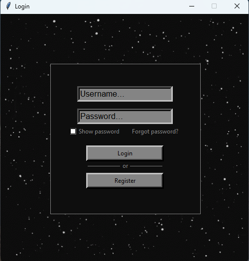

  
Register

  
  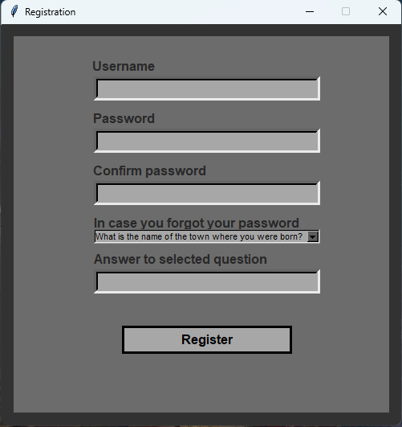

  
Forgot password

  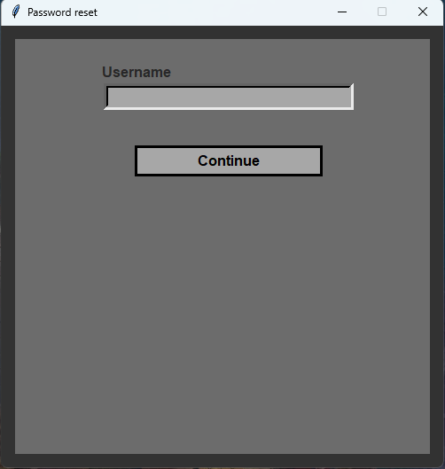
  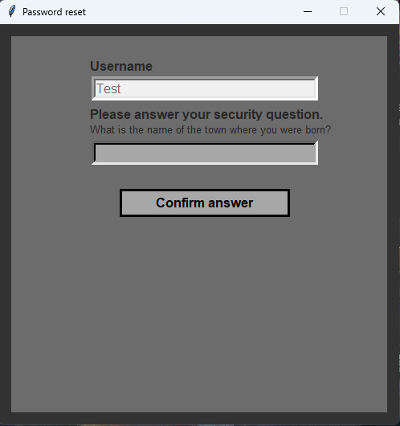
  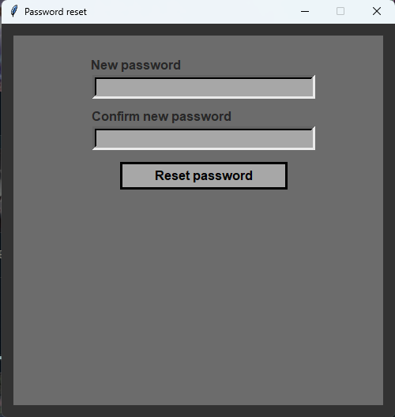

# Account view

  
Games

  
  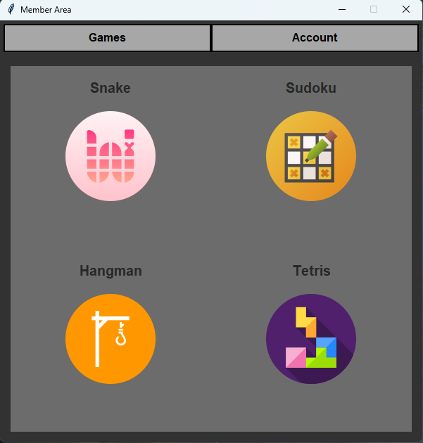
  

    
Sudoku

  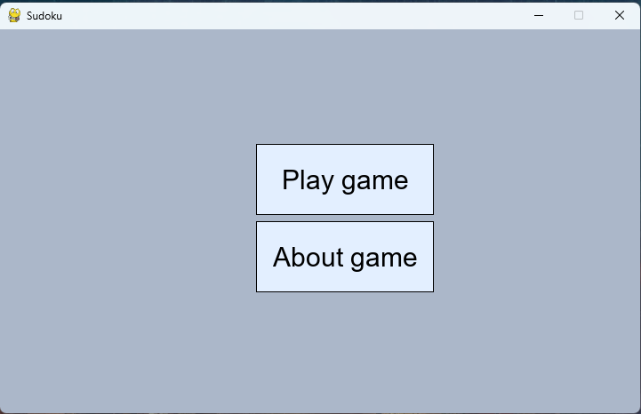
  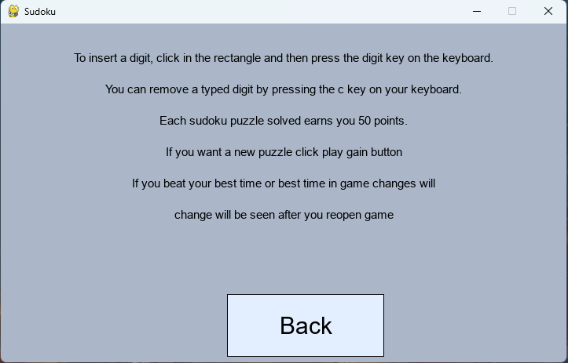
  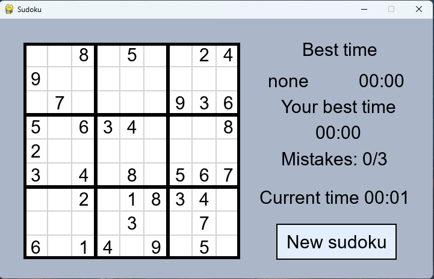
  

  

    
Snake

  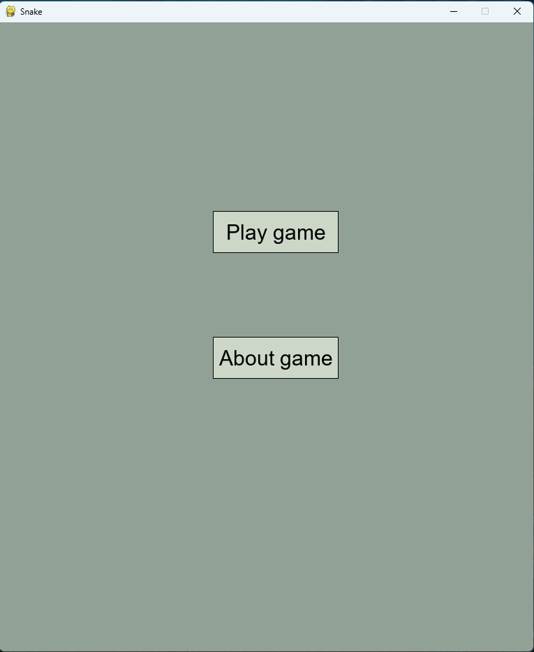
  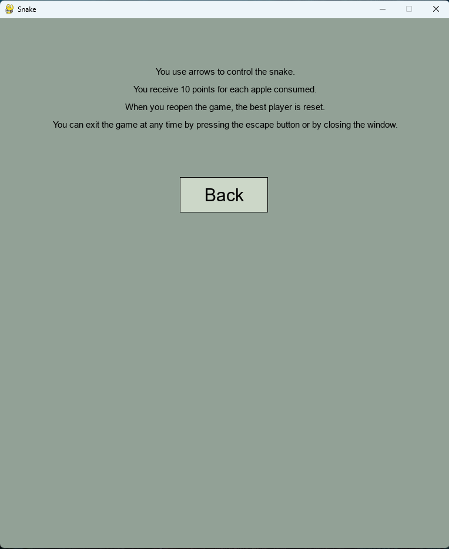
  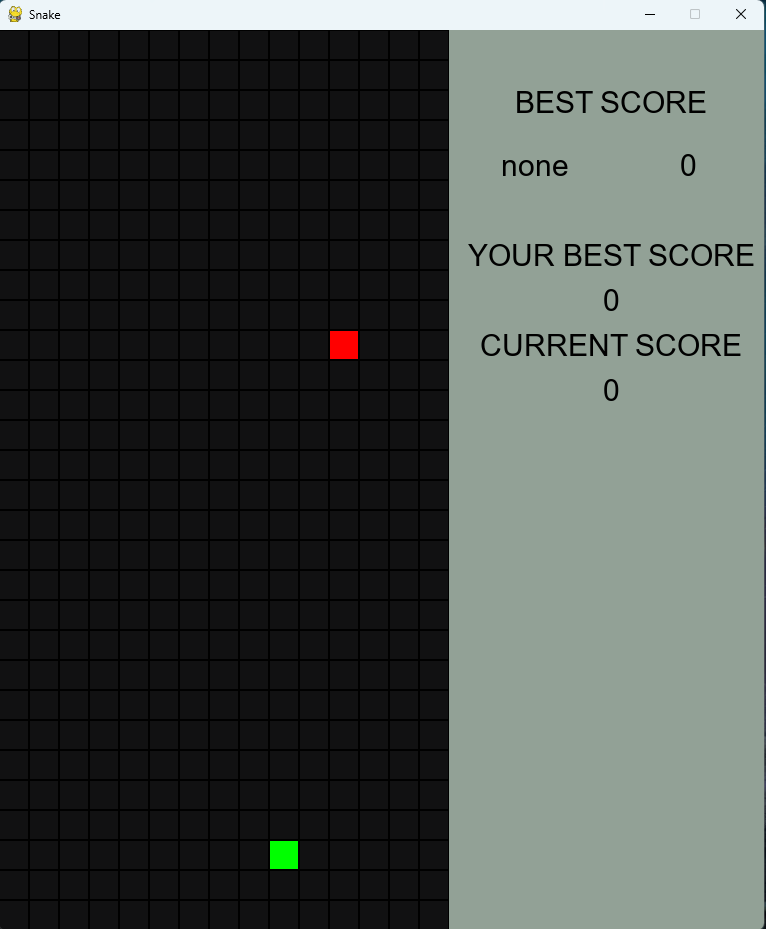
  

  

    
Hangman

  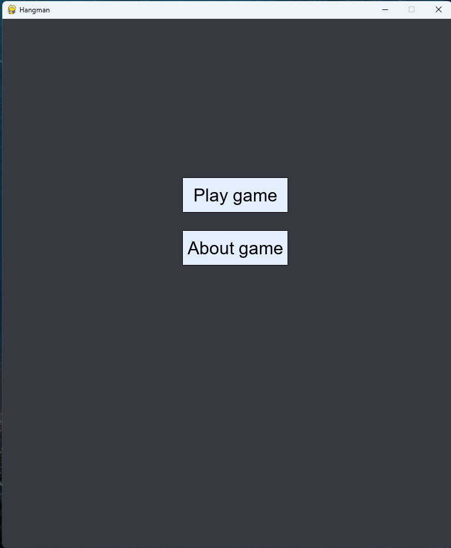
  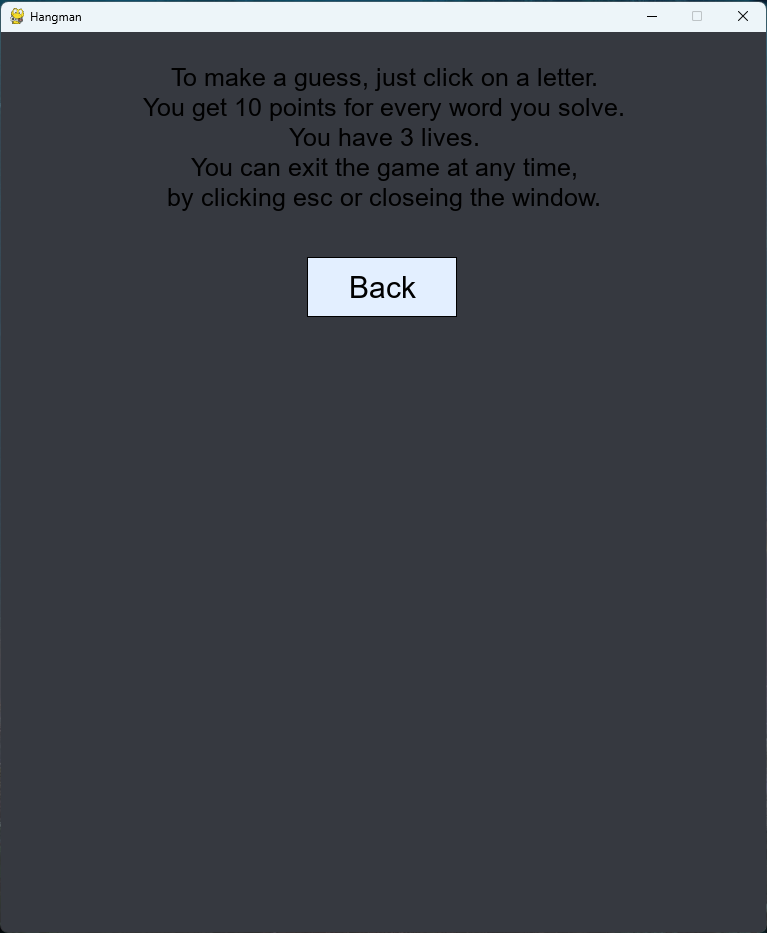
  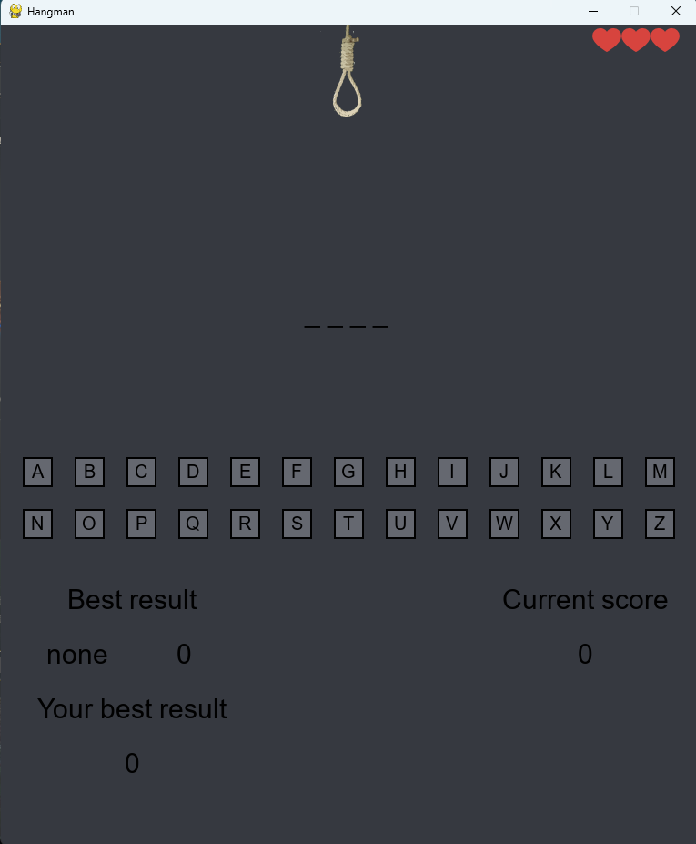
  

  

    
Tetris

  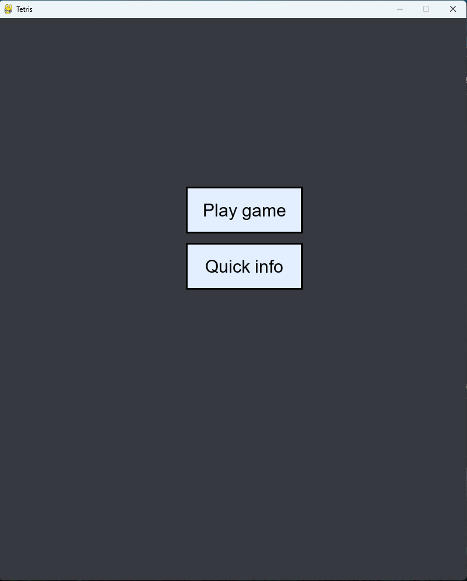
  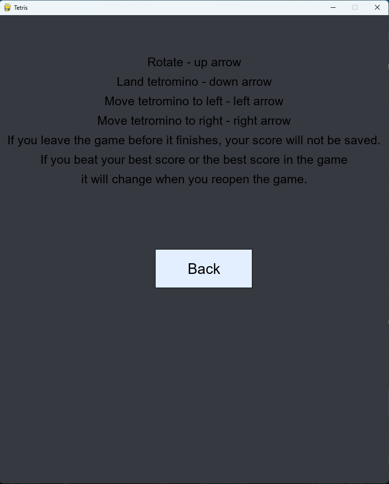
  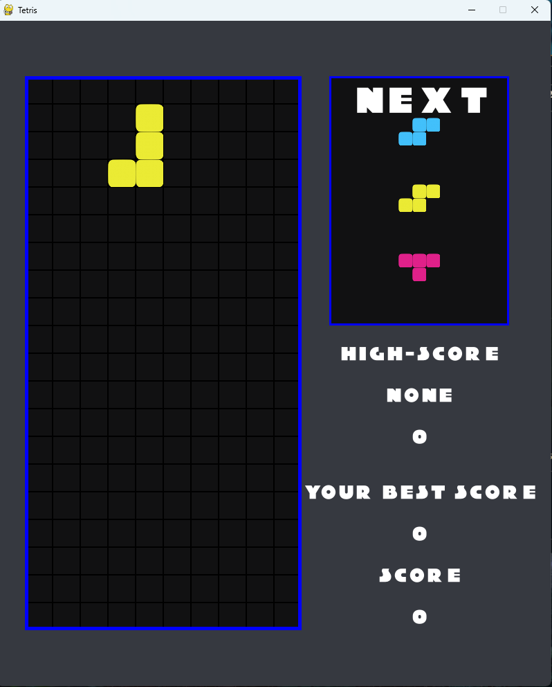
  

  
Account settings

  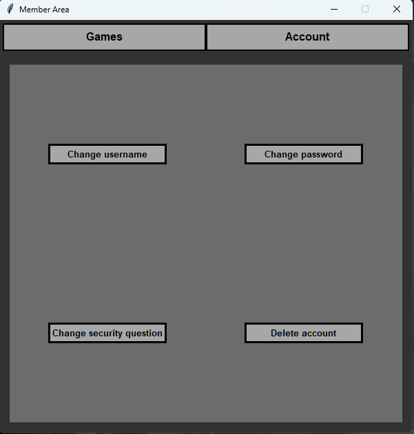

  

    
Change username

  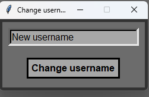
  

  

    
Delete account

  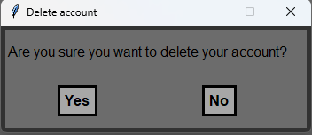
  

  

    
Change password

  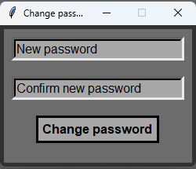
  

  

    
Change security question

 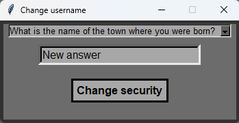
  

# User Interface Features

**Authentication Module (user_auth):**
- **User Registration**: Users can easily register in the system, providing their necessary information.
- **Login**: Registered users can log into their accounts securely.
- **Password Recovery**: In the event of forgotten passwords, users have the option to recover their accounts.
- **Security Measures**: Stringent security measures are in place to verify user data and safeguard against unauthorized access.

**User Panel (user_panel):**
- **Personalized Experience**: Once logged in, users gain access to their individualized panel.
- **Profile Management**: Users can view and update their profile information.
- **Game Scores**: Detailed game scores and progress tracking are available for users to monitor their achievements.
- **Account Settings**: Users have the capability to manage their account settings for a tailored experience.

**Available Games**

**Snake (snake):**
- **Description**: The classic Snake game challenges players to control a growing snake as it consumes food and avoids collisions with walls and itself.
- **Difficulty Levels**: As the snake consumes food, it increases in length, intensifying the gameplay.

**Tetris (tetris):**
- **Description**: The legendary Tetris game tasks players with arranging falling blocks to complete horizontal lines without gaps.
- **Scoring**: Points are awarded for each successfully completed line, encouraging strategic block placement.

**Hangman (hangman):**
- **Description**: Hangman is a word game where players guess a hidden word by selecting letters. Mistakes result in the gradual drawing of a hangman figure.
- **Objective**: The goal is to guess the word correctly before the hangman is fully drawn.

**Sudoku (sudoku):**
- **Description**: Sudoku is a logic-based number puzzle game where players aim to fill a 9x9 board with numbers from 1 to 9, ensuring that each number appears only once in each row, column, and 3x3 square.
- **Logic and Strategy**: Players must employ logic and strategy to solve the puzzle, making it a cerebral challenge.

**GameVault Description**

"GameVault" is an **gaming platform** offering users a diverse selection of games and a comprehensive system for tracking scores and progress. By seamlessly integrating **database technology** with an **intuitive user interface**, "GameVault" distinguishes itself through its commitment to **innovation** and **user-friendliness**.

**How to Use**

**Installation Steps:**
1. Clone the repository to your local machine.
2. Install the necessary packages by running `pip install -r requirements.txt`.
3. Modify the database configuration in `database.py`, including the host, password, and user.
4. Execute `configuration.py` to set up initial configurations.
5. Run the main application by executing `main.py`.
